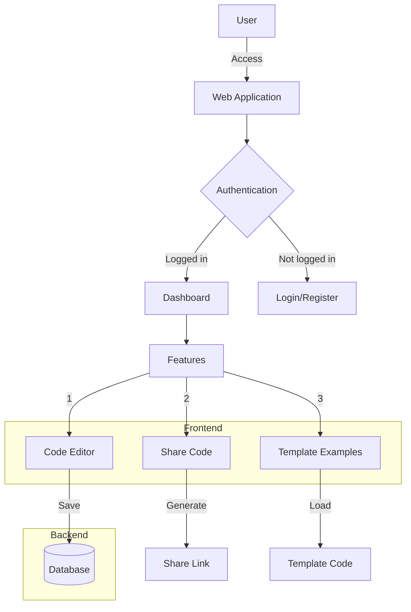
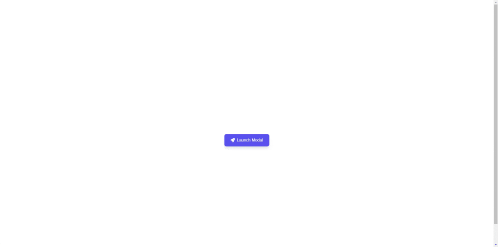
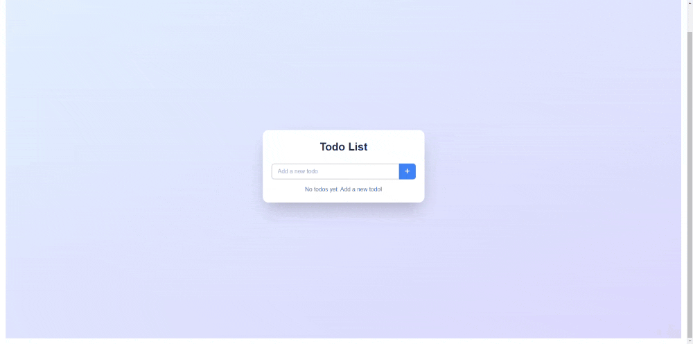

  An open source project that can generate React Components.

## Workflow

## Tech stack

- [Claude AI](https://www.anthropic.com/) Claude AI Models
- [Sandpack](https://sandpack.codesandbox.io/) for the code sandbox
- Next.js app router with Tailwind
- Prisma Postgress Database
- CodeSandbox/Sandpack (Code editor)
- Tailwind CSS (Styling)

## Examples Demo generated using ReactAI

- [Popup Modal](https://reactai.vasarai.net/share/_ajy9)

- [Newsletter Form](https://reactai.vasarai.net/share/qfhed)

- [Todo App](https://reactai.vasarai.net/share/nLQ1G)

- [Counter App](https://reactai.vasarai.net/share/EGzfh)

- [Calculator App](https://reactai.vasarai.net/share/SNSb3)

- [Image Generator](https://reactai.vasarai.net/share/gldbD)

- [Chat App](https://reactai.vasarai.net/share/450ym)

